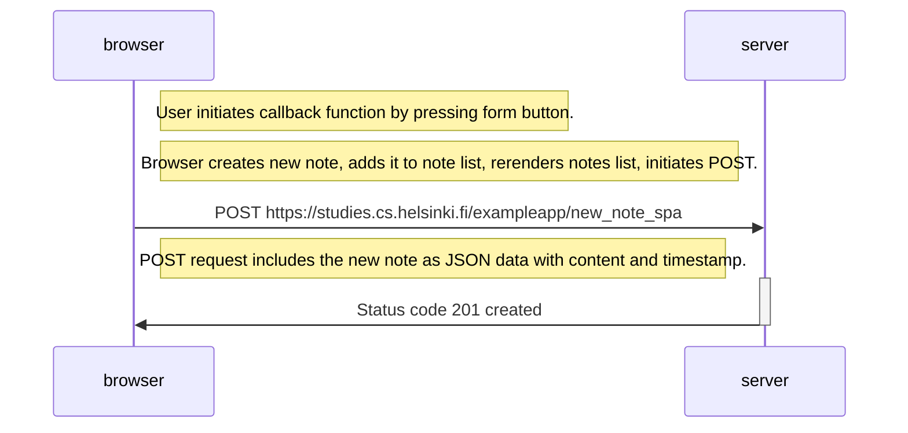

```mermaid
sequenceDiagram

    participant browser
    participant server

    Note right of browser: User initiates callback function by pressing form button.
    Note right of browser: Browser creates new note, adds it to note list, rerenders notes list, initiates POST.
    
    browser->>server: POST https://studies.cs.helsinki.fi/exampleapp/new_note_spa
    Note right of browser: POST request includes the new note as JSON data with content and timestamp.
    activate server
    server->>browser: Status code 201 created
    deactivate server
```